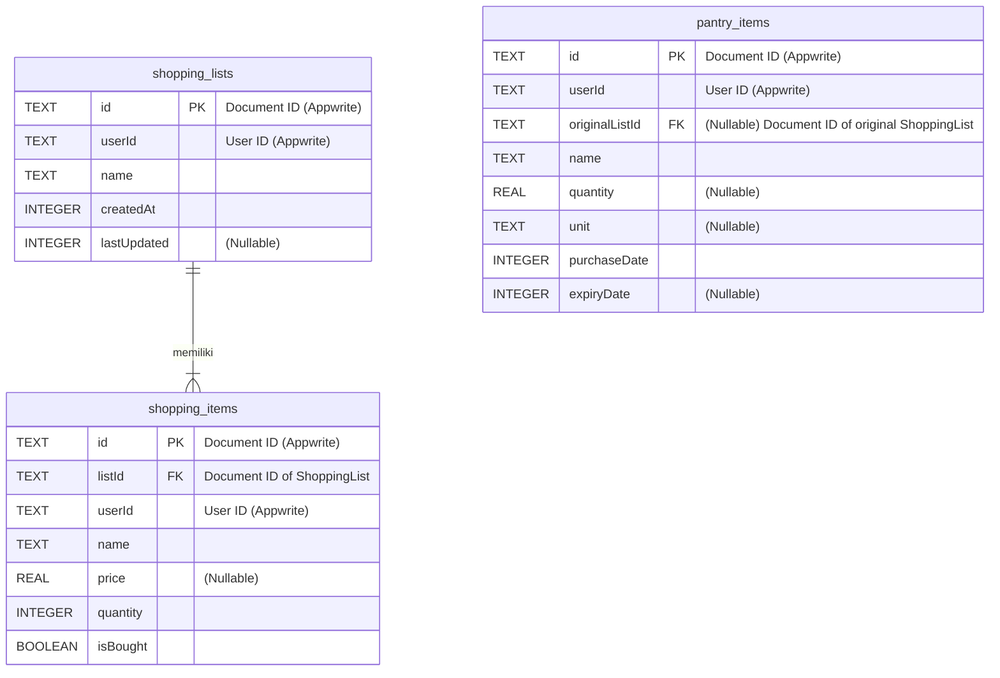

### Entity-Relationship Diagram (ERD) - Aplikasi Daftar Belanjaku

> **CATATAN PENTING:** Desain ini merupakan representasi konseptual dari entitas data dan hubungannya. Implementasi saat ini menggunakan **Appwrite Backend-as-a-Service (BaaS)** sebagai backend, yang menggunakan pendekatan penyimpanan berbasis dokumen (NoSQL). Oleh karena itu, konsep seperti `PRIMARY KEY` dan `FOREIGN KEY` diimplementasikan sebagai atribut dokumen dan dikelola oleh logika aplikasi, bukan oleh batasan database relasional. Diagram ini tetap berguna sebagai referensi konseptual tentang hubungan antar entitas data.

#### Legenda Notasi (Crow's Foot Notation)

*   `PK`: Primary Key (Kunci Utama)
*   `FK`: Foreign Key (Kunci Asing)
*   `|` : Menandakan "Satu" (One)
*   `<` : Menandakan "Banyak" (Many)
*   `o` : Menandakan "Opsional" (Zero or...)
*   `||`: Menandakan "Satu dan Hanya Satu" (One and Only One)
*   `|<`: Menandakan "Satu atau Banyak" (One or Many)

---

#### Diagram

Diagram ini menunjukkan hubungan antara entitas utama yang dikelola di Appwrite:

---

#### Penjelasan Hubungan

1.  **`shopping_lists` dan `shopping_items`**
    *   **Jenis Hubungan:** Satu-ke-Banyak (*One-to-Many*)
    *   **Deskripsi:**
        *   Satu `shopping_list` dapat memiliki **satu atau banyak** `shopping_items`.
        *   Setiap `shopping_item` harus terhubung ke **satu dan hanya satu** `shopping_list`.
    *   **Implementasi Teknis:** Hubungan ini diimplementasikan melalui atribut `list_id` di dokumen `shopping_items` yang menyimpan `\$id` dari dokumen `shopping_lists`. Kepemilikan pengguna diimplementasikan melalui atribut `user_id` di kedua entitas. Jika sebuah `shopping_list` dihapus, semua `shopping_items` yang terkait dengannya juga akan dihapus melalui logika aplikasi.