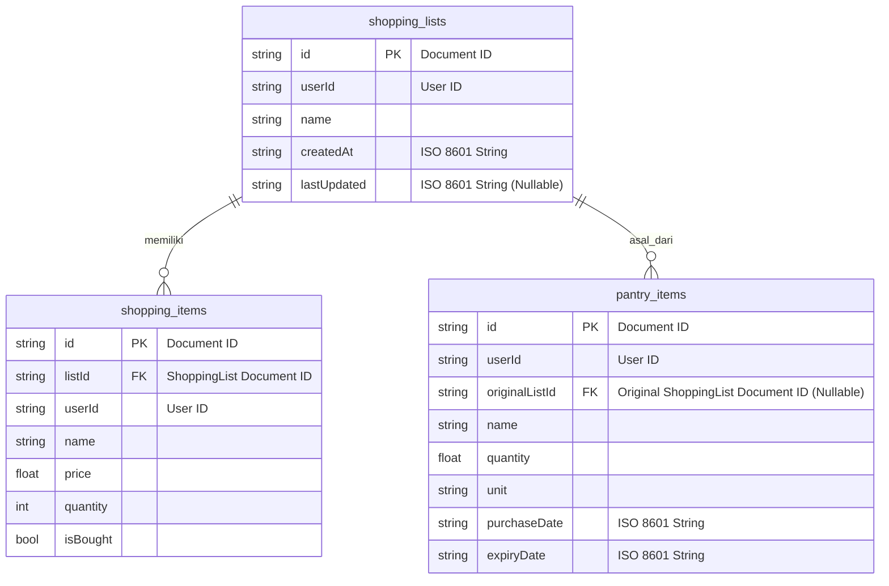

### Skema Database - Aplikasi Aplikasi Daftar Belanjaku

> **CATATAN PENTING:** Skema ini merupakan desain konseptual awal yang ditujukan untuk implementasi menggunakan **Appwrite Backend-as-a-Service (BaaS)**. Appwrite menggunakan pendekatan penyimpanan berbasis dokumen (NoSQL). Oleh karena itu, konsep seperti `PRIMARY KEY` dan `FOREIGN KEY` diimplementasikan sebagai atribut dokumen dan dikelola oleh logika aplikasi, bukan oleh batasan database relasional. Dokumen ini tetap berguna sebagai referensi konseptual tentang atribut data yang diperlukan untuk setiap entitas.

**Database Engine:** Appwrite Backend-as-a-Service (BaaS)

---

**1. Koleksi: `shopping_lists`**

Koleksi ini akan menyimpan informasi tentang setiap daftar belanja yang dibuat oleh pengguna.

*   **Tujuan:** Menyimpan daftar-daftar belanja utama.

*   **Atribut Dokumen:**

    *   `\$id` (String)

        *   **Deskripsi:** ID unik dokumen yang dihasilkan oleh Appwrite.

    *   `userId` (String)

        *   **Deskripsi:** ID pengguna Appwrite yang memiliki daftar ini. Digunakan untuk kepemilikan dan filter data.

    *   `name` (String)

        *   **Deskripsi:** Nama daftar belanja (misal: "Belanja Mingguan", "Supermarket").

    *   `createdAt` (DateTime)

        *   **Deskripsi:** Timestamp saat daftar dibuat (disimpan sebagai ISO 8601 String).

    *   `lastUpdated` (DateTime)

        *   **Deskripsi:** Timestamp saat daftar terakhir diubah (Nullable, disimpan sebagai ISO 8601 String).

---

**2. Koleksi: `shopping_items`**

Koleksi ini akan menyimpan detail item-item yang ada di dalam setiap daftar belanja.

*   **Tujuan:** Menyimpan item-item spesifik dalam daftar belanja.

*   **Atribut Dokumen:**

    *   `\$id` (String)

        *   **Deskripsi:** ID unik dokumen yang dihasilkan oleh Appwrite.

    *   `listId` (String)

        *   **Deskripsi:** ID dokumen `shopping_lists` tempat item ini berada. Berfungsi sebagai *Foreign Key* konseptual.

    *   `userId` (String)

        *   **Deskripsi:** ID pengguna Appwrite yang memiliki item ini.

    *   `name` (String)

        *   **Deskripsi:** Nama barang (misal: "Beras", "Saus Tomat").

    *   `price` (Double)

        *   **Deskripsi:** Harga barang (Nullable).

    *   `quantity` (Integer)

        *   **Deskripsi:** Kuantitas barang.

    *   `isBought` (Boolean)

        *   **Deskripsi:** Status apakah item sudah dibeli atau belum (Default: `false`).

---

**3. Koleksi: `pantry_items`**

Koleksi ini menyimpan inventaris item yang sudah dibeli oleh pengguna, yang dipindahkan dari daftar belanja.

*   **Tujuan:** Melacak stok barang di rumah dan tanggal kedaluwarsanya.

*   **Atribut Dokumen:**

    *   `\$id` (String)

        *   **Deskripsi:** ID unik dokumen yang dihasilkan oleh Appwrite.

    *   `userId` (String)

        *   **Deskripsi:** ID pengguna Appwrite yang memiliki item ini.

    *   `originalListId` (String)

        *   **Deskripsi:** ID dokumen `shopping_lists` asal item ini (Nullable). Digunakan untuk fitur "Kembalikan ke Daftar".

    *   `name` (String)

        *   **Deskripsi:** Nama barang.

    *   `quantity` (Double)

        *   **Deskripsi:** Kuantitas barang (Nullable).

    *   `unit` (String)

        *   **Deskripsi:** Satuan barang (Nullable).

    *   `purchaseDate` (DateTime)

        *   **Deskripsi:** Timestamp saat item ditambahkan ke pantry (disimpan sebagai ISO 8601 String).

    *   `expiryDate` (DateTime)

        *   **Deskripsi:** Timestamp tanggal kedaluwarsa item (Nullable, disimpan sebagai ISO 8601 String).

---

### Diagram Hubungan Entitas (ERD - Konseptual)

---

Skema ini mencakup semua entitas dan properti yang kita diskusikan, termasuk hubungan dan batasan yang diperlukan untuk menjaga integritas data dalam aplikasi yang *simple* dan *ringan* menggunakan Appwrite.